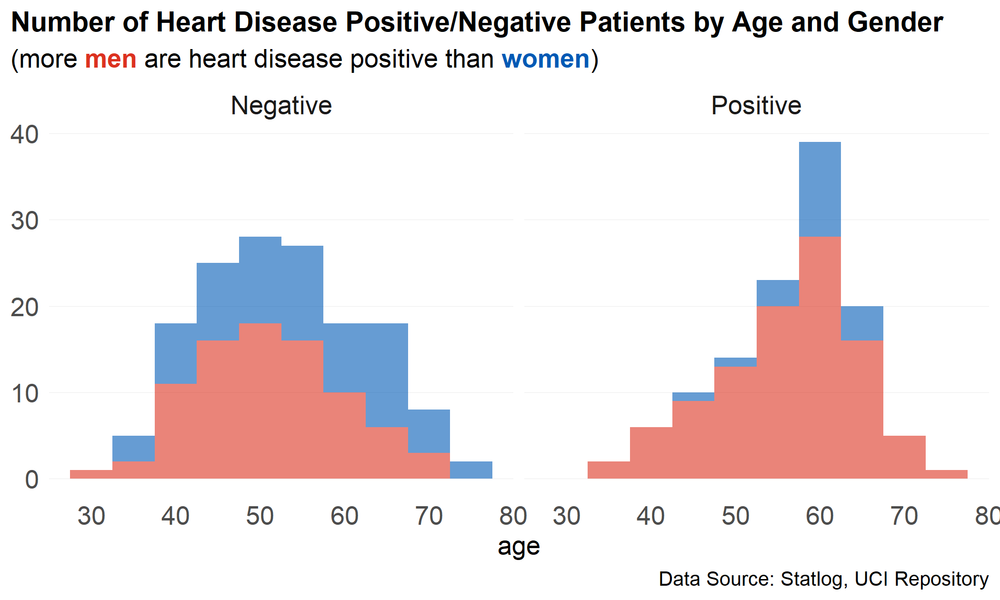
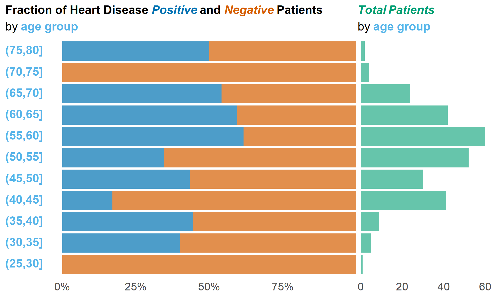
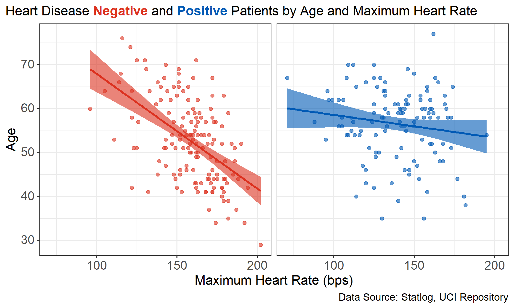

# Data Visualization Project 01

The [Statlog heart disease dataset](https://archive.ics.uci.edu/ml/datasets/statlog+(heart)) was used to make the following visualizations. Heart disease is a leading cause of death in the USA  [(CDC)](https://www.cdc.gov/globalhealth/healthprotection/ncd/cardiovascular-diseases.html) and globally  [(WHO)](https://www.who.int/health-topics/cardiovascular-diseases#tab=tab_1). 

## ***Heart Disease by Age and Gender***

During the exploratory analysis of this dataset, I observed a significant difference in heart disease status based on sex. Though women make up a smaller proportion of the entire dataset, the difference when comparing those who are heart disease negative versus positive is dramatic. More men are heart disease positive than women, and sex appears to be a significant predictor for heart disease. 

Age is another apparent predictor for heart disease with the histograms for heart disease negative and positive patients being oppositely skewed--heart disease negative patients tend to be younger and positive tend to be older. 

## ***Heart Disease Status as a Fraction of Total Observations***

Another relationship I was interested in showing is how the proportion of heart disease positive to negative patients varies with age. The expectation was that the proportion increases with age. Also important to consider is the number of observations available for each age, as this is not uniform in the dataset. 

The above visualization does show the expected relationship, though not very compellingly. Generally, the proportion of heart disease positive patients is larger at higher ages. With a larger dataset (this one is fewer than three hundred observations), a pattern may be more obvious. 

## ***Heart Disease by Age and Maximum Heart Rate***

When considering heart disease status, very few of the available variables appeared to be significant. The most interesting scatter plots were those produced by looking at maximum heart rate in relation to age. While middle age patients seem to have similar maximum heart rate values, whether heart disease positive or negative, younger patients who have relatively high maximum heart rates and older patients who have lower maximum heart rates seem to be less likely to have heart disease. Regarding the age of the patients in this dataset, all patients younger than 35 are heart disease negative and most patients above 70 (excluding 1) are also heart disease negative.

---

