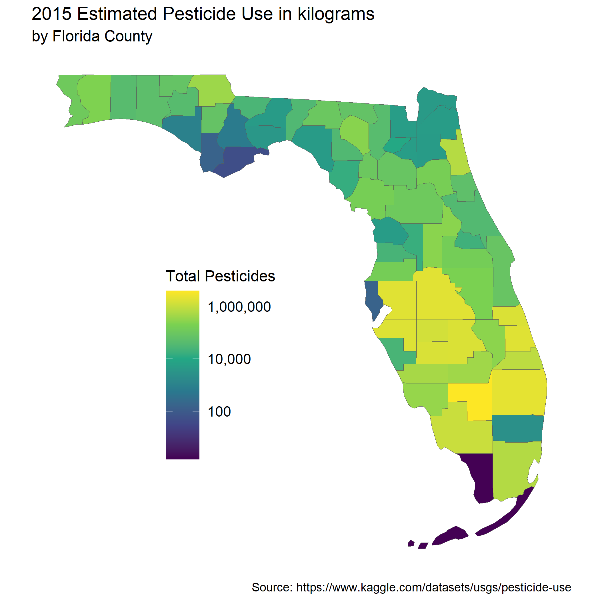
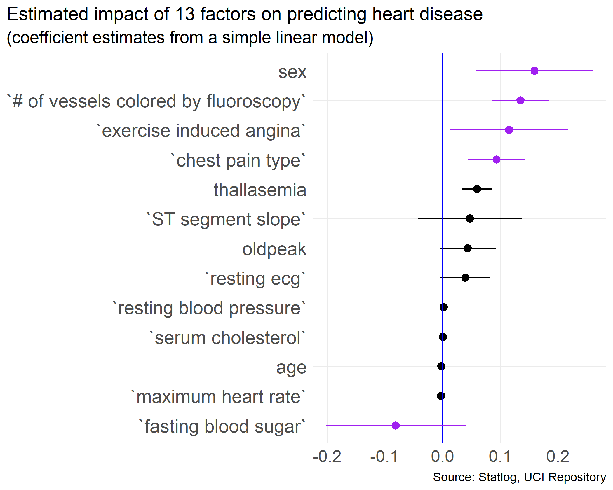

# Data Visualization Project 02

Two data sets (and a county shapesfile) were used to make the following visualizations:

- [2015 Pesticide Use in U.S. Agriculture](https://www.kaggle.com/datasets/usgs/pesticide-use)
  - Visualization 1 - **an interactive plot** (*2015 Estimated Pesticide Use by Florida County*)
  - Visualization 2 - **a spatial visualization** (*2015 Estimated Pesticide Use by Florida County*)
- [Statlog heart disease dataset](https://www.kaggle.com/datasets/shubamsumbria/statlog-heart-data-set)
  - Visualization 3 - **coefficients of a linear model** (*Estimated impact of 13 factors on predicting heart disease*)
  
The Statlog dataset was originally accessed through the [UCI repository](https://archive.ics.uci.edu/ml/datasets/statlog+(heart)). It currently appears to be broken/missing. The first (Kaggle) link above for the *Statlog heart disease dataset* does currently work.

## **2015 Estimated Pesticide Use by Florida County**

### ***an interactive plot***

The below plot is static and has been reduced in size. For a larger and interactive version, scroll down.


{width=675px, height=600px}


```{=html}
<div id="htmlwidget-2daf9b394de1f9b372bc" style="width:900px;height:800px;" class="plotly html-widget "></div>
<script type="application/json" data-for="htmlwidget-2daf9b394de1f9b372bc">{"x":{"data":[{"x":[6.57809560072447,6.31601761174789,6.27271896998704,6.27140414231342,6.25600514476462,6.23417328022478,6.20469195168715,6.20379954514624,6.19724614409463,6.11579567133879,6.02843708051799,5.90647096655915,5.8258397014966,5.80175292621271,5.69024828086056,5.62837125135041,5.59791512889181,5.53403816962419,5.44713631607524,5.43259380842794,5.41533833599444,5.3307381553891,5.299099179619,5.22143953834545,5.21922761899383,5.18687274408793,5.17478409415427,5.0626553004843,5.03916417921062,4.99533108200839,4.98641699021734,4.92660891052913,4.91353941869172,4.8612744732501,4.85237262667408,4.83512149494229,4.74411766492285,4.72017088443773,4.63664734242135,4.62147125247303,4.61934694300222,4.5427246191199,4.51487832811769,4.51255899825867,4.4306345025876,4.4052421716532,4.38390508697691,4.28700853051978,4.21446499925173,4.17502157838287,4.0298584009934,3.7291566871082,3.72159629940867,3.69874411246845,3.69482448421058,3.68504272337555,3.68197349164788,3.67239344718103,3.65928853806458,3.57093969441374,3.37311438120346,2.9795483747041,2.82988244644349,2.21272015441784,2.20194306340165,1.70500795933334,0.176091259055681],"y":[67,66,65,64,63,62,61,60,59,58,57,56,55,54,53,52,51,50,49,48,47,46,45,44,43,42,41,40,39,38,37,36,35,34,33,32,31,30,29,28,27,26,25,24,23,22,21,20,19,18,17,16,15,14,13,12,11,10,9,8,7,6,5,4,3,2,1],"text":["reorder(County, `high estimate`): Hendry<br />high estimate: 3785259.0","reorder(County, `high estimate`): Palm Beach<br />high estimate: 2070225.3","reorder(County, `high estimate`): Polk<br />high estimate: 1873781.6","reorder(County, `high estimate`): Hillsborough<br />high estimate: 1868117.3","reorder(County, `high estimate`): St. Lucie<br />high estimate: 1803039.1","reorder(County, `high estimate`): Manatee<br />high estimate: 1714641.3","reorder(County, `high estimate`): Indian River<br />high estimate: 1602108.6","reorder(County, `high estimate`): Highlands<br />high estimate: 1598819.9","reorder(County, `high estimate`): DeSoto<br />high estimate: 1574875.2","reorder(County, `high estimate`): Hardee<br />high estimate: 1305556.5","reorder(County, `high estimate`): Collier<br />high estimate: 1067670.1","reorder(County, `high estimate`): Martin<br />high estimate:  806252.3","reorder(County, `high estimate`): St. Johns<br />high estimate:  669637.4","reorder(County, `high estimate`): Miami-Dade<br />high estimate:  633509.2","reorder(County, `high estimate`): Charlotte<br />high estimate:  490058.9","reorder(County, `high estimate`): Glades<br />high estimate:  424982.7","reorder(County, `high estimate`): Jackson<br />high estimate:  396200.6","reorder(County, `high estimate`): Lee<br />high estimate:  342009.5","reorder(County, `high estimate`): Okeechobee<br />high estimate:  279986.0","reorder(County, `high estimate`): Lake<br />high estimate:  270765.8","reorder(County, `high estimate`): Suwannee<br />high estimate:  260218.6","reorder(County, `high estimate`): Santa Rosa<br />high estimate:  214159.9","reorder(County, `high estimate`): Osceola<br />high estimate:  199112.8","reorder(County, `high estimate`): Putnam<br />high estimate:  166509.7","reorder(County, `high estimate`): Levy<br />high estimate:  165663.8","reorder(County, `high estimate`): Pasco<br />high estimate:  153770.4","reorder(County, `high estimate`): Orange<br />high estimate:  149549.2","reorder(County, `high estimate`): Escambia<br />high estimate:  115519.5","reorder(County, `high estimate`): Marion<br />high estimate:  109437.0","reorder(County, `high estimate`): Gilchrist<br />high estimate:   98930.7","reorder(County, `high estimate`): Madison<br />high estimate:   96920.8","reorder(County, `high estimate`): Alachua<br />high estimate:   84451.8","reorder(County, `high estimate`): Brevard<br />high estimate:   81948.2","reorder(County, `high estimate`): Holmes<br />high estimate:   72656.5","reorder(County, `high estimate`): Calhoun<br />high estimate:   71182.4","reorder(County, `high estimate`): Hamilton<br />high estimate:   68410.3","reorder(County, `high estimate`): Flagler<br />high estimate:   55477.6","reorder(County, `high estimate`): Walton<br />high estimate:   52501.4","reorder(County, `high estimate`): Columbia<br />high estimate:   43315.9","reorder(County, `high estimate`): Okaloosa<br />high estimate:   41828.4","reorder(County, `high estimate`): Washington<br />high estimate:   41624.3","reorder(County, `high estimate`): Volusia<br />high estimate:   34891.9","reorder(County, `high estimate`): Lafayette<br />high estimate:   32724.9","reorder(County, `high estimate`): Jefferson<br />high estimate:   32550.6","reorder(County, `high estimate`): Gadsden<br />high estimate:   26954.7","reorder(County, `high estimate`): Sarasota<br />high estimate:   25423.9","reorder(County, `high estimate`): Hernando<br />high estimate:   24205.0","reorder(County, `high estimate`): Seminole<br />high estimate:   19364.6","reorder(County, `high estimate`): Sumter<br />high estimate:   16385.7","reorder(County, `high estimate`): Dixie<br />high estimate:   14963.1","reorder(County, `high estimate`): Union<br />high estimate:   10711.7","reorder(County, `high estimate`): Baker<br />high estimate:    5359.9","reorder(County, `high estimate`): Bradford<br />high estimate:    5267.4","reorder(County, `high estimate`): Duval<br />high estimate:    4997.4","reorder(County, `high estimate`): Citrus<br />high estimate:    4952.5","reorder(County, `high estimate`): Leon<br />high estimate:    4842.2","reorder(County, `high estimate`): Clay<br />high estimate:    4808.1","reorder(County, `high estimate`): Taylor<br />high estimate:    4703.2","reorder(County, `high estimate`): Nassau<br />high estimate:    4563.4","reorder(County, `high estimate`): Wakulla<br />high estimate:    3723.4","reorder(County, `high estimate`): Broward<br />high estimate:    2361.1","reorder(County, `high estimate`): Bay<br />high estimate:     954.0","reorder(County, `high estimate`): Liberty<br />high estimate:     675.9","reorder(County, `high estimate`): Pinellas<br />high estimate:     163.2","reorder(County, `high estimate`): Gulf<br />high estimate:     159.2","reorder(County, `high estimate`): Franklin<br />high estimate:      50.7","reorder(County, `high estimate`): Monroe<br />high estimate:       1.5"],"type":"scatter","mode":"markers","marker":{"autocolorscale":false,"color":"rgba(0,0,0,1)","opacity":1,"size":5.66929133858268,"symbol":"circle","line":{"width":1.88976377952756,"color":"rgba(0,0,0,1)"}},"hoveron":"points","showlegend":false,"xaxis":"x","yaxis":"y","hoverinfo":"text","frame":null},{"x":[6.57809560072447,6.31601761174789,6.27271896998704,6.27140414231342,6.25600514476462,6.23417328022478,6.20469195168715,6.20379954514624,6.19724614409463,6.11579567133879,6.02843708051799,5.90647096655915,5.8258397014966,5.80175292621271,5.69024828086056,5.62837125135041,5.59791512889181,5.53403816962419,5.44713631607524,5.43259380842794],"y":[67,66,65,64,63,62,61,60,59,58,57,56,55,54,53,52,51,50,49,48],"text":["reorder(County, `high estimate`): Hendry<br />high estimate: 3785259.0","reorder(County, `high estimate`): Palm Beach<br />high estimate: 2070225.3","reorder(County, `high estimate`): Polk<br />high estimate: 1873781.6","reorder(County, `high estimate`): Hillsborough<br />high estimate: 1868117.3","reorder(County, `high estimate`): St. Lucie<br />high estimate: 1803039.1","reorder(County, `high estimate`): Manatee<br />high estimate: 1714641.3","reorder(County, `high estimate`): Indian River<br />high estimate: 1602108.6","reorder(County, `high estimate`): Highlands<br />high estimate: 1598819.9","reorder(County, `high estimate`): DeSoto<br />high estimate: 1574875.2","reorder(County, `high estimate`): Hardee<br />high estimate: 1305556.5","reorder(County, `high estimate`): Collier<br />high estimate: 1067670.1","reorder(County, `high estimate`): Martin<br />high estimate:  806252.3","reorder(County, `high estimate`): St. Johns<br />high estimate:  669637.4","reorder(County, `high estimate`): Miami-Dade<br />high estimate:  633509.2","reorder(County, `high estimate`): Charlotte<br />high estimate:  490058.9","reorder(County, `high estimate`): Glades<br />high estimate:  424982.7","reorder(County, `high estimate`): Jackson<br />high estimate:  396200.6","reorder(County, `high estimate`): Lee<br />high estimate:  342009.5","reorder(County, `high estimate`): Okeechobee<br />high estimate:  279986.0","reorder(County, `high estimate`): Lake<br />high estimate:  270765.8"],"type":"scatter","mode":"markers","marker":{"autocolorscale":false,"color":"rgba(255,0,0,1)","opacity":1,"size":5.66929133858268,"symbol":"circle","line":{"width":1.88976377952756,"color":"rgba(255,0,0,1)"}},"hoveron":"points","showlegend":false,"xaxis":"x","yaxis":"y","hoverinfo":"text","frame":null},{"x":[0.176091259055681,1.70500795933334,2.20194306340165,2.21272015441784,2.82988244644349,2.9795483747041,3.37311438120346,3.57093969441374,3.65928853806458,3.67239344718103,3.68197349164788,3.68504272337555,3.69482448421058,3.69874411246845,3.72159629940867,3.7291566871082,4.0298584009934,4.17502157838287,4.21446499925173,4.28700853051978],"y":[1,2,3,4,5,6,7,8,9,10,11,12,13,14,15,16,17,18,19,20],"text":["reorder(County, `high estimate`): Monroe<br />high estimate:     1.5","reorder(County, `high estimate`): Franklin<br />high estimate:    50.7","reorder(County, `high estimate`): Gulf<br />high estimate:   159.2","reorder(County, `high estimate`): Pinellas<br />high estimate:   163.2","reorder(County, `high estimate`): Liberty<br />high estimate:   675.9","reorder(County, `high estimate`): Bay<br />high estimate:   954.0","reorder(County, `high estimate`): Broward<br />high estimate:  2361.1","reorder(County, `high estimate`): Wakulla<br />high estimate:  3723.4","reorder(County, `high estimate`): Nassau<br />high estimate:  4563.4","reorder(County, `high estimate`): Taylor<br />high estimate:  4703.2","reorder(County, `high estimate`): Clay<br />high estimate:  4808.1","reorder(County, `high estimate`): Leon<br />high estimate:  4842.2","reorder(County, `high estimate`): Citrus<br />high estimate:  4952.5","reorder(County, `high estimate`): Duval<br />high estimate:  4997.4","reorder(County, `high estimate`): Bradford<br />high estimate:  5267.4","reorder(County, `high estimate`): Baker<br />high estimate:  5359.9","reorder(County, `high estimate`): Union<br />high estimate: 10711.7","reorder(County, `high estimate`): Dixie<br />high estimate: 14963.1","reorder(County, `high estimate`): Sumter<br />high estimate: 16385.7","reorder(County, `high estimate`): Seminole<br />high estimate: 19364.6"],"type":"scatter","mode":"markers","marker":{"autocolorscale":false,"color":"rgba(0,0,255,1)","opacity":1,"size":5.66929133858268,"symbol":"circle","line":{"width":1.88976377952756,"color":"rgba(0,0,255,1)"}},"hoveron":"points","showlegend":false,"xaxis":"x","yaxis":"y","hoverinfo":"text","frame":null},{"x":[5],"y":[62],"text":"Top 5 Agricultural Counties<br />(based on 2017 market<br />values from fdacs.gov):<br />- Palm Beach<br />- Miami-Dade<br />- Hillsborough<br />- Manatee<br />- Hendry)","hovertext":"x: 62<br />y: 1e+05","textfont":{"size":11.3385826771654,"color":"rgba(255,0,0,1)"},"type":"scatter","mode":"text","hoveron":"points","showlegend":false,"xaxis":"x","yaxis":"y","hoverinfo":"text","frame":null},{"x":[1],"y":[10],"text":"Bottom 5 Agricultural Counties<br />(based on 2017 market<br />values from fdacs.gov):<br />- Wakulla<br />- Liberty<br />- Gulf<br />- Pinellas<br />- Franklin)","hovertext":"x: 10<br />y: 10","textfont":{"size":11.3385826771654,"color":"rgba(0,0,255,1)"},"type":"scatter","mode":"text","hoveron":"points","showlegend":false,"xaxis":"x","yaxis":"y","hoverinfo":"text","frame":null}],"layout":{"margin":{"t":41.7534246575342,"r":7.30593607305936,"b":38.1735159817352,"l":95.7077625570777},"font":{"color":"rgba(0,0,0,1)","family":"","size":14.6118721461187},"title":{"text":"2015 Estimated Pesticide Use by Florida County","font":{"color":"rgba(0,0,0,1)","family":"","size":17.5342465753425},"x":0,"xref":"paper"},"xaxis":{"domain":[0,1],"automargin":true,"type":"linear","autorange":false,"range":[-0.144008958027758,6.89819581780791],"tickmode":"array","ticktext":["10","1,000","100,000"],"tickvals":[1,3,5],"categoryorder":"array","categoryarray":["10","1,000","100,000"],"nticks":null,"ticks":"","tickcolor":null,"ticklen":3.65296803652968,"tickwidth":0,"showticklabels":true,"tickfont":{"color":"rgba(77,77,77,1)","family":"","size":11.689497716895},"tickangle":-0,"showline":false,"linecolor":null,"linewidth":0,"showgrid":true,"gridcolor":"rgba(235,235,235,1)","gridwidth":0.66417600664176,"zeroline":false,"anchor":"y","title":{"text":"high estimate","font":{"color":"rgba(0,0,0,1)","family":"","size":14.6118721461187}},"hoverformat":".2f"},"yaxis":{"domain":[0,1],"automargin":true,"type":"linear","autorange":false,"range":[0.4,67.6],"tickmode":"array","ticktext":["Monroe","Franklin","Gulf","Pinellas","Liberty","Bay","Broward","Wakulla","Nassau","Taylor","Clay","Leon","Citrus","Duval","Bradford","Baker","Union","Dixie","Sumter","Seminole","Hernando","Sarasota","Gadsden","Jefferson","Lafayette","Volusia","Washington","Okaloosa","Columbia","Walton","Flagler","Hamilton","Calhoun","Holmes","Brevard","Alachua","Madison","Gilchrist","Marion","Escambia","Orange","Pasco","Levy","Putnam","Osceola","Santa Rosa","Suwannee","Lake","Okeechobee","Lee","Jackson","Glades","Charlotte","Miami-Dade","St. Johns","Martin","Collier","Hardee","DeSoto","Highlands","Indian River","Manatee","St. Lucie","Hillsborough","Polk","Palm Beach","Hendry"],"tickvals":[1,2,3,4,5,6,7,8,9,10,11,12,13,14,15,16,17,18,19,20,21,22,23,24,25,26,27,28,29,30,31,32,33,34,35,36,37,38,39,40,41,42,43,44,45,46,47,48,49,50,51,52,53,54,55,56,57,58,59,60,61,62,63,64,65,66,67],"categoryorder":"array","categoryarray":["Monroe","Franklin","Gulf","Pinellas","Liberty","Bay","Broward","Wakulla","Nassau","Taylor","Clay","Leon","Citrus","Duval","Bradford","Baker","Union","Dixie","Sumter","Seminole","Hernando","Sarasota","Gadsden","Jefferson","Lafayette","Volusia","Washington","Okaloosa","Columbia","Walton","Flagler","Hamilton","Calhoun","Holmes","Brevard","Alachua","Madison","Gilchrist","Marion","Escambia","Orange","Pasco","Levy","Putnam","Osceola","Santa Rosa","Suwannee","Lake","Okeechobee","Lee","Jackson","Glades","Charlotte","Miami-Dade","St. Johns","Martin","Collier","Hardee","DeSoto","Highlands","Indian River","Manatee","St. Lucie","Hillsborough","Polk","Palm Beach","Hendry"],"nticks":null,"ticks":"","tickcolor":null,"ticklen":3.65296803652968,"tickwidth":0,"showticklabels":true,"tickfont":{"color":"rgba(77,77,77,1)","family":"","size":11.689497716895},"tickangle":-0,"showline":false,"linecolor":null,"linewidth":0,"showgrid":true,"gridcolor":"rgba(235,235,235,1)","gridwidth":0.66417600664176,"zeroline":false,"anchor":"x","title":{"text":"County","font":{"color":"rgba(0,0,0,1)","family":"","size":14.6118721461187}},"hoverformat":".2f"},"shapes":[{"type":"rect","fillcolor":null,"line":{"color":null,"width":0,"linetype":[]},"yref":"paper","xref":"paper","x0":0,"x1":1,"y0":0,"y1":1}],"showlegend":false,"legend":{"bgcolor":null,"bordercolor":null,"borderwidth":0,"font":{"color":"rgba(0,0,0,1)","family":"","size":11.689497716895}},"hovermode":"closest","width":900,"height":800,"barmode":"relative"},"config":{"doubleClick":"reset","modeBarButtonsToAdd":["hoverclosest","hovercompare"],"showSendToCloud":false},"source":"A","attrs":{"210427d4664d":{"x":{},"y":{},"type":"scatter"},"21041707199b":{"x":{},"y":{}},"21048087cf5":{"x":{},"y":{}},"210435807e1c":{"x":{},"y":{}},"210464fc67f2":{"x":{},"y":{}}},"cur_data":"210427d4664d","visdat":{"210427d4664d":["function (y) ","x"],"21041707199b":["function (y) ","x"],"21048087cf5":["function (y) ","x"],"210435807e1c":["function (y) ","x"],"210464fc67f2":["function (y) ","x"]},"highlight":{"on":"plotly_click","persistent":false,"dynamic":false,"selectize":false,"opacityDim":0.2,"selected":{"opacity":1},"debounce":0},"shinyEvents":["plotly_hover","plotly_click","plotly_selected","plotly_relayout","plotly_brushed","plotly_brushing","plotly_clickannotation","plotly_doubleclick","plotly_deselect","plotly_afterplot","plotly_sunburstclick"],"base_url":"https://plot.ly"},"evals":[],"jsHooks":[]}</script>
```


> Note: The interactivity for the above plot works offline but does not render correctly in GitHub. 

The above plot shows the estimated total pesticide use by Florida counties in 2015. The top 20 counties are in red and the bottom in blue. Unsurprisingly, highly agricultural counties use more pesticides than others. This was confirmed by referencing the 2017 agricultural market values from the [Florida Department of Agriculture and Consumer Services](https://www.fdacs.gov/Agriculture-Industry/Florida-Agriculture-Overview-and-Statistics).

### ***a spatial visualization***





The above map shows the same information as the first visualization, but we are now able to recognize areas of Florida that may be difficult to distinguish in a list of county names. 

There is little to no pesticide use in the 

- Keys
- Everglades

There is also very little use in the pan handle near Apalachicola National Forest. 

Most of the pesticide use is in central to south-central Florida. Quite likely this map indicates the density of farmland in Florida counties. Some interesting extensions would be to:

- normalize the results by farmland acreage
- include algae bloom data


## **Estimated impact of 13 factors on predicting heart disease**

### ***Modeling Heart Disease*** - predictor significance





For the third visualization, the Statlog Heart Disease data set was used (the same data set used in mini-project 1). A linear model was made to predict heart disease (positive versus negative) using all thirteen available predictors. In the above coefficients plot, we see that 

- sex,
- number of vessels colored by fluoroscopy,
- exercise induced angina,
- chest pain type,
- and fasting blood sugar

are the most significant predictors. 

Interestingly, 

- resting blood pressure,
- serum cholesterol,
- age,
- and maximum heart rate

appear to have very little predictive power. 

The linear model created was very simple and is not recommended for prediction purposes. However, the coefficients plot can be used in additional analysis and feature selection. 

---
