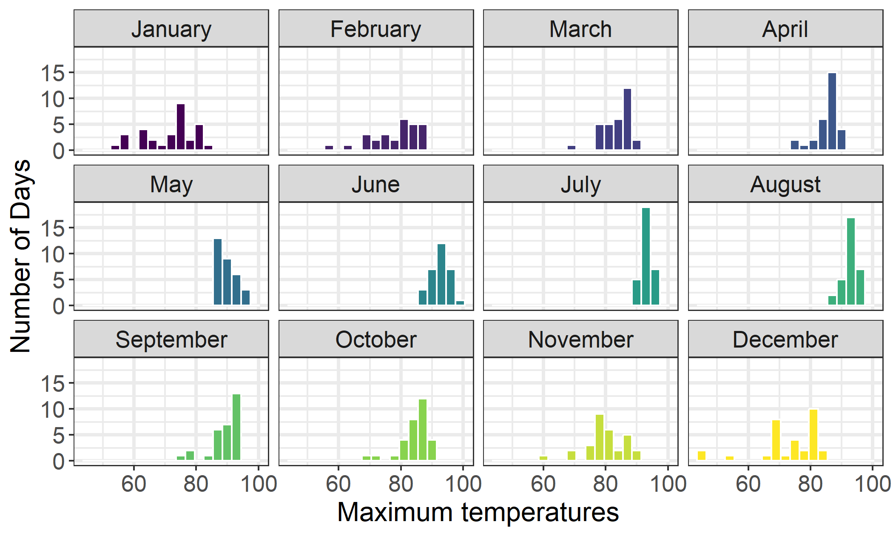
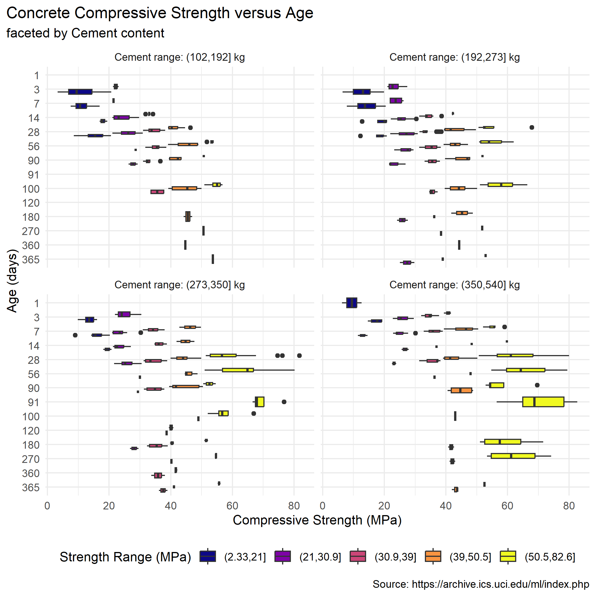
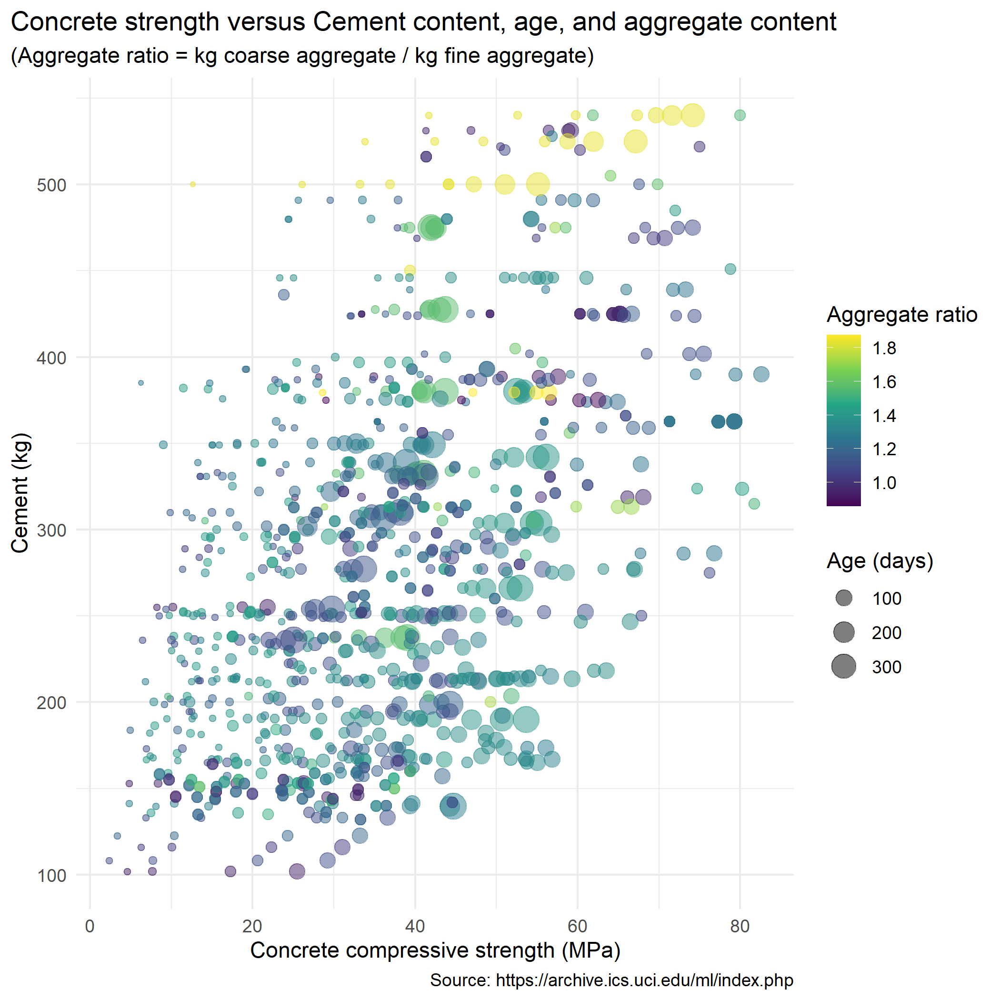

# Data Visualization Project 03


In this exercise you will explore methods to create different types of data visualizations (such as plotting text data, or exploring the distributions of continuous variables).


## PART 1: Density Plots

Using the dataset obtained from FSU's [Florida Climate Center](https://climatecenter.fsu.edu/climate-data-access-tools/downloadable-data), for a station at Tampa International Airport (TPA) for 2022, attempt to recreate the charts shown below which were generated using data from 2016. You can read the 2022 dataset using the code below: 


```r
library(tidyverse)
weather_tpa <- read_csv("https://raw.githubusercontent.com/reisanar/datasets/master/tpa_weather_2022.csv")
# random sample 
sample_n(weather_tpa, 4)
```

```
## # A tibble: 4 × 7
##    year month   day precipitation max_temp min_temp ave_temp
##   <dbl> <dbl> <dbl>         <dbl>    <dbl>    <dbl>    <dbl>
## 1  2022     1    24          0          63       40     51.5
## 2  2022     5    20          0.17       88       75     81.5
## 3  2022     9    15          0          91       75     83  
## 4  2022    10    15          0          88       74     81
```

See https://www.reisanar.com/slides/relationships-models#10 for a reminder on how to use this type of dataset with the `lubridate` package for dates and times (example included in the slides uses data from 2016).

Using the 2022 data: 

(a) Create a plot like the one below:


Hint: the option `binwidth = 3` was used with the `geom_histogram()` function.


```r
# prepare data for histogram
tpa_month <- weather_tpa %>%
  mutate(Month = lubridate::month(month, label = TRUE, abb = FALSE))

tpa_month %>% sample_n(3)
```

```
## # A tibble: 3 × 8
##    year month   day precipitation max_temp min_temp ave_temp Month   
##   <dbl> <dbl> <dbl>         <dbl>    <dbl>    <dbl>    <dbl> <ord>   
## 1  2022    12    10       0             80       62       71 December
## 2  2022     3    10       0.00001       84       72       78 March   
## 3  2022     8    12       0             92       80       86 August
```


```r
theme_set(theme_bw())

tpa_month %>%
  ggplot() +
  geom_histogram(aes(x = max_temp, fill = month), 
                 binwidth = 3, 
                 color = "white") +
  scale_fill_viridis_c() +
#  scale_x_continuous(breaks = seq(50,100,10)) + # omitted: less clutter by 20s
  facet_wrap(vars(Month)) +
  labs(x = "Maximum temperatures",
       y = "Number of Days") +
  theme(legend.position = "none",
        strip.text.x = element_text(size = 13),
        axis.title.x = element_text(size = 15),
        axis.title.y = element_text(size = 15),
        axis.text.y = element_text(size = 13),
        axis.text.x = element_text(size = 13),
        panel.grid = element_line(linewidth = 1))
```




(b) Create a plot like the one below:


Hint: check the `kernel` parameter of the `geom_density()` function, and use `bw = 0.5`.


```r
theme_set(theme_minimal())

weather_tpa %>%
  ggplot() +
  geom_density(aes(x = max_temp), 
               kernel = "optcosin", bw = 0.5, 
               fill = "grey50", size = 1) +
  labs(x = "Maximum temperature") +
  theme(axis.title.x = element_text(size = 15),
        axis.title.y = element_text(size = 15),
        axis.text.x = element_text(size = 13),
        axis.text.y = element_text(size = 13),
        panel.grid = element_line(linewidth = 1))
```

```
## Warning: Using `size` aesthetic for lines was deprecated in ggplot2 3.4.0.
## ℹ Please use `linewidth` instead.
## This warning is displayed once every 8 hours.
## Call `lifecycle::last_lifecycle_warnings()` to see where this warning was
## generated.
```


(c) Create a plot like the one below:


Hint: default options for `geom_density()` were used. 


```r
theme_set(theme_bw())

tpa_month %>%
  ggplot() +
  geom_density(aes(x = max_temp, fill = Month),
               alpha = 0.6, size = 1) +
  scale_y_continuous(breaks = seq(0,0.30,0.1)) +
  facet_wrap(vars(Month)) +
  labs(title = "Density plots for each month in 2022",
       x = "Maximum temperatures") +
  theme(legend.position = "none",
        plot.title = element_text(size = 20),
        strip.text.x = element_text(size = 15),
        axis.text.x = element_text(size = 14),
        axis.title.x = element_text(size = 15),
        axis.text.y = element_text(size = 13),
        axis.title.y = element_blank(),
        panel.grid = element_line(linewidth = 1))
```


(d) Generate a plot like the chart below:


Hint: use the`{ggridges}` package, and the `geom_density_ridges()` function paying close attention to the `quantile_lines` and `quantiles` parameters. The plot above uses the `plasma` option (color scale) for the _viridis_ palette.


```r
theme_set(theme_minimal())

library(ggridges)
```

```
## Warning: package 'ggridges' was built under R version 4.3.1
```

```r
tpa_month %>%
  ggplot(aes(x = max_temp, y = Month, fill = after_stat(x))) +
  geom_density_ridges_gradient(quantile_lines = TRUE, quantiles = 2,
                               size = 1) + # "deprecated" warning noted, but get "ignoring" warning using linewidth 
  scale_fill_viridis_c(option = "C") +
  scale_x_continuous(breaks = seq(40, 100, 10)) +
  labs(x = "Maximum temperature (in Fahrenheit degrees)",
       fill = element_blank(),
       y = element_blank()) +
  theme(axis.title.x = element_text(size = 17),
        axis.text.y = element_text(size = 13),
        axis.text.x = element_text(size = 13),
        legend.text = element_text(size = 13),
        panel.grid = element_line(linewidth = 1))
```

```
## Picking joint bandwidth of 1.93
```

```
## Warning: Using the `size` aesthetic with geom_segment was deprecated in ggplot2 3.4.0.
## ℹ Please use the `linewidth` aesthetic instead.
## This warning is displayed once every 8 hours.
## Call `lifecycle::last_lifecycle_warnings()` to see where this warning was
## generated.
```


(e) Create a plot of your choice that uses the attribute for precipitation _(values of -99.9 for temperature or -99.99 for precipitation represent missing data)_.


```r
library(scales)
```

```
## 
## Attaching package: 'scales'
```

```
## The following object is masked from 'package:purrr':
## 
##     discard
```

```
## The following object is masked from 'package:readr':
## 
##     col_factor
```


```r
tpa_month %>%
  summarize_all(range) # obs: no -99.99 missing values
```

```
## Warning: Returning more (or less) than 1 row per `summarise()` group was deprecated in
## dplyr 1.1.0.
## ℹ Please use `reframe()` instead.
## ℹ When switching from `summarise()` to `reframe()`, remember that `reframe()`
##   always returns an ungrouped data frame and adjust accordingly.
## ℹ The deprecated feature was likely used in the dplyr package.
##   Please report the issue at <https://github.com/tidyverse/dplyr/issues>.
## This warning is displayed once every 8 hours.
## Call `lifecycle::last_lifecycle_warnings()` to see where this warning was
## generated.
```

```
## # A tibble: 2 × 8
##    year month   day precipitation max_temp min_temp ave_temp Month   
##   <dbl> <dbl> <dbl>         <dbl>    <dbl>    <dbl>    <dbl> <ord>   
## 1  2022     1     1          0          45       31     38   January 
## 2  2022    12    31          2.86       98       83     89.5 December
```


```r
tpa_doy <- weather_tpa %>% 
  unite("doy", year, month, day, sep = "-") %>% 
  mutate(doy = ymd(doy))

tpa_doy %>% sample_n(5)
```

```
## # A tibble: 5 × 5
##   doy        precipitation max_temp min_temp ave_temp
##   <date>             <dbl>    <dbl>    <dbl>    <dbl>
## 1 2022-01-29          0          55       41     48  
## 2 2022-12-22          0.15       69       59     64  
## 3 2022-11-17          0          69       53     61  
## 4 2022-12-17          0.02       70       54     62  
## 5 2022-11-10          2.46       74       67     70.5
```


```r
tpa_monthly_precip <- tpa_month %>%
  group_by(Month) %>%
  summarize(tot_precip = sum(precipitation))
```


```r
theme_set(theme_minimal())

ggplot() +
  geom_bar(data = tpa_monthly_precip, 
           aes(x = Month, y = tot_precip, fill = tot_precip),
           stat = "identity", alpha = 0.6) +
  geom_jitter(data = tpa_month,
              aes(x = Month, y = precipitation), alpha = 0.6) +
  coord_flip() +
  scale_x_discrete(limits = rev) +
  scale_y_continuous(breaks = seq(0, 12, 2)) +
  labs(title = "Tampa 2022 - monthly precipitation",
       subtitle = "(points = daily precipitation, bars = monthly total)",
       caption = "data source: https://climatecenter.fsu.edu/climate-data-access-tools/downloadable-data",
       x = element_blank(),
       y = "precipitation (inches)") +
  guides(fill = "none") +
  theme(plot.title.position = "plot",
        plot.title = element_text(size = 15),
        plot.subtitle = element_text(size = 13),
        axis.title.x = element_text(size = 13),
        axis.text.x = element_text(size = 13), 
        axis.text.y = element_text(size = 13),
        panel.grid = element_line(linewidth = 0.25))
```


## PART 2 


### Option (B): Data on Concrete Strength 

Concrete is the most important material in **civil engineering**. The concrete compressive strength is a highly nonlinear function of _age_ and _ingredients_. The dataset used here is from the [UCI Machine Learning Repository](https://archive.ics.uci.edu/ml/index.php), and it contains 1030 observations with 9 different attributes 9 (8 quantitative input variables, and 1 quantitative output variable). A data dictionary is included below: 


Variable                      |    Notes                
------------------------------|-------------------------------------------
Cement                        | kg in a $m^3$ mixture             
Blast Furnace Slag            | kg in a $m^3$ mixture  
Fly Ash                       | kg in a $m^3$ mixture             
Water                         | kg in a $m^3$ mixture              
Superplasticizer              | kg in a $m^3$ mixture
Coarse Aggregate              | kg in a $m^3$ mixture
Fine Aggregate                | kg in a $m^3$ mixture      
Age                           | in days                                             
Concrete compressive strength | MPa, megapascals


Below we read the `.csv` file using `readr::read_csv()` (the `readr` package is part of the `tidyverse`)


```r
concrete <- read_csv("../data/concrete.csv", col_types = cols())
```


Let us create a new attribute for visualization purposes, `strength_range`: 


```r
new_concrete <- concrete %>%
  mutate(strength_range = cut(Concrete_compressive_strength, 
                              breaks = quantile(Concrete_compressive_strength, 
                                                probs = seq(0, 1, 0.2))) )
```


1. Explore the distribution of 2 of the continuous variables available in the dataset. Do ranges make sense? Comment on your findings.


```r
new_concrete %>% sample_n(5)
```

```
## # A tibble: 5 × 10
##   Cement Blast_Furnace_Slag Fly_Ash Water Superplasticizer Coarse_Aggregate
##    <dbl>              <dbl>   <dbl> <dbl>            <dbl>            <dbl>
## 1   184.               123.      0   204.              0               959.
## 2   302                  0       0   203               0               974 
## 3   219.                 0     124.  158.             11.3            1079.
## 4   307                  0       0   193               0               968 
## 5   331                  0       0   192               0              1025 
## # ℹ 4 more variables: Fine_Aggregate <dbl>, Age <dbl>,
## #   Concrete_compressive_strength <dbl>, strength_range <fct>
```


```r
new_concrete %>% 
  select(-strength_range) %>% # remove categorical
  summarize_all(~range(.))
```

```
## # A tibble: 2 × 9
##   Cement Blast_Furnace_Slag Fly_Ash Water Superplasticizer Coarse_Aggregate
##    <dbl>              <dbl>   <dbl> <dbl>            <dbl>            <dbl>
## 1    102                 0       0   122.              0                801
## 2    540               359.    200.  247              32.2             1145
## # ℹ 3 more variables: Fine_Aggregate <dbl>, Age <dbl>,
## #   Concrete_compressive_strength <dbl>
```


```r
new_concrete %>% summary()
```

```
##      Cement      Blast_Furnace_Slag    Fly_Ash           Water      
##  Min.   :102.0   Min.   :  0.0      Min.   :  0.00   Min.   :121.8  
##  1st Qu.:192.4   1st Qu.:  0.0      1st Qu.:  0.00   1st Qu.:164.9  
##  Median :272.9   Median : 22.0      Median :  0.00   Median :185.0  
##  Mean   :281.2   Mean   : 73.9      Mean   : 54.19   Mean   :181.6  
##  3rd Qu.:350.0   3rd Qu.:142.9      3rd Qu.:118.27   3rd Qu.:192.0  
##  Max.   :540.0   Max.   :359.4      Max.   :200.10   Max.   :247.0  
##  Superplasticizer Coarse_Aggregate Fine_Aggregate       Age        
##  Min.   : 0.000   Min.   : 801.0   Min.   :594.0   Min.   :  1.00  
##  1st Qu.: 0.000   1st Qu.: 932.0   1st Qu.:731.0   1st Qu.:  7.00  
##  Median : 6.350   Median : 968.0   Median :779.5   Median : 28.00  
##  Mean   : 6.203   Mean   : 972.9   Mean   :773.6   Mean   : 45.66  
##  3rd Qu.:10.160   3rd Qu.:1029.4   3rd Qu.:824.0   3rd Qu.: 56.00  
##  Max.   :32.200   Max.   :1145.0   Max.   :992.6   Max.   :365.00  
##  Concrete_compressive_strength     strength_range
##  Min.   : 2.332                (2.33,21]  :205   
##  1st Qu.:23.707                (21,30.9]  :206   
##  Median :34.443                (30.9,39]  :206   
##  Mean   :35.818                (39,50.5]  :206   
##  3rd Qu.:46.136                (50.5,82.6]:206   
##  Max.   :82.599                NA's       :  1
```


```r
new_concrete %>%
  ggplot(aes(x = Fly_Ash)) +
  geom_histogram()
```

```
## `stat_bin()` using `bins = 30`. Pick better value with `binwidth`.
```

<!-- -->


```r
(new_concrete %>% filter(Fly_Ash == 0) %>% nrow()) / nrow(new_concrete)
```

```
## [1] 0.5495146
```

```r
# more than half of the Fly_Ash values are 0
```


```r
new_concrete %>%
  ggplot(aes(x = Age)) +
  geom_histogram(binwidth = 5)
```

<!-- -->

***Observations***

> When summarizing (`summary()`) the concrete data, it was observed that the 1st quartile for three attributes is 0: Blast_Furnace_Slag, Fly_Ash, Superplasticizer. The media for Fly_Ash is also 0. Therefore, Fly_Ash was chosen as one of the continuous variables to explore the distribution of, to try to make more sense of this initial observation. From the histogram and the calculation following it, it was found that more than 50% of the Fly_Ash values are 0. 

> From the `summary()`, we can see that the Age ranges from 1 to 365 (year). Age was chosen as the second attribute to explore to see if the tested ages are evenly spaced throughout the year. From the histogram, it is clear that most of the testing happens within the first month of aging. 


2. Use a _temporal_ indicator such as the one available in the variable `Age` (measured in days). Generate a plot similar to the one shown below. Comment on your results.


```r
newer_concrete <- new_concrete %>%
  mutate(cement_range = cut(Cement, 
                            breaks = quantile(Cement, 
                                              probs = seq(0, 1, 0.25))) ) %>%
  filter(cement_range != "NA",
         strength_range != "NA") # filter out NAs for cleaner legends in plots

newer_concrete <- newer_concrete %>%
  mutate(CementRange = paste0("Cement range: ", newer_concrete$cement_range, " kg")) # new column for plot facet header clarity
```


```r
newer_concrete %>% group_by(CementRange) %>%
  summarize(n())
```

```
## # A tibble: 4 × 2
##   CementRange                `n()`
##   <chr>                      <int>
## 1 Cement range: (102,192] kg   253
## 2 Cement range: (192,273] kg   257
## 3 Cement range: (273,350] kg   259
## 4 Cement range: (350,540] kg   256
```


```r
head(newer_concrete)
```

```
## # A tibble: 6 × 12
##   Cement Blast_Furnace_Slag Fly_Ash Water Superplasticizer Coarse_Aggregate
##    <dbl>              <dbl>   <dbl> <dbl>            <dbl>            <dbl>
## 1   540                  0        0   162              2.5            1040 
## 2   540                  0        0   162              2.5            1055 
## 3   332.               142.       0   228              0               932 
## 4   332.               142.       0   228              0               932 
## 5   199.               132.       0   192              0               978.
## 6   266                114        0   228              0               932 
## # ℹ 6 more variables: Fine_Aggregate <dbl>, Age <dbl>,
## #   Concrete_compressive_strength <dbl>, strength_range <fct>,
## #   cement_range <fct>, CementRange <chr>
```


```r
library(viridis)
```

```
## Loading required package: viridisLite
```

```
## 
## Attaching package: 'viridis'
```

```
## The following object is masked from 'package:scales':
## 
##     viridis_pal
```

```r
theme_set(theme_minimal())

newer_concrete %>%
  filter(cement_range != "NA") %>%
  ggplot(aes(x = as.factor(Age), y = Concrete_compressive_strength,
             fill = strength_range)) +
  geom_boxplot() +
  facet_wrap(vars(CementRange)) +
  scale_fill_viridis_d(option = "plasma") +
  coord_flip() +
  scale_x_discrete(limits = rev) +
  labs(title = "Concrete Compressive Strength versus Age",
       subtitle = "faceted by Cement content", 
       caption = "Source: https://archive.ics.uci.edu/ml/index.php",
       y = "Compressive Strength (MPa)",
       x = "Age (days)",
       fill = "Strength Range (MPa)") +
  theme(plot.title.position = "plot",
        legend.position = "bottom")
```


> ***Observations:***
For all of the facets (all cement contents), greater age is generally associated with stronger concrete; however, there are diminishing returns that level off after the first couple months of aging. While it is redundant to color code the compressive strength ranges, this makes it easier to see that larger amounts of cement appear to be associated with greater compressive strengths overall. The highest compressive strengths are seen in the bottom right facet, for which the cement content is the highest. After three months of aging, all boxplots for this cement range show compressive strengths above 40 MPa.


3. Create a scatterplot similar to the one shown below. Pay special attention to which variables are being mapped to specific aesthetics of the plot. Comment on your results. 


```r
concrete %>% head()
```

```
## # A tibble: 6 × 9
##   Cement Blast_Furnace_Slag Fly_Ash Water Superplasticizer Coarse_Aggregate
##    <dbl>              <dbl>   <dbl> <dbl>            <dbl>            <dbl>
## 1   540                  0        0   162              2.5            1040 
## 2   540                  0        0   162              2.5            1055 
## 3   332.               142.       0   228              0               932 
## 4   332.               142.       0   228              0               932 
## 5   199.               132.       0   192              0               978.
## 6   266                114        0   228              0               932 
## # ℹ 3 more variables: Fine_Aggregate <dbl>, Age <dbl>,
## #   Concrete_compressive_strength <dbl>
```


```r
new_concrete_plus <- new_concrete %>%
  mutate(Coarse_to_Fine = Coarse_Aggregate / Fine_Aggregate)
```


```r
theme_set(theme_minimal())

new_concrete_plus %>%
  ggplot() +
  geom_point(aes(x = Concrete_compressive_strength, y = Cement, color = Coarse_to_Fine, size = Age), alpha = 0.5) +
  scale_color_viridis_c() +
  labs(title = "Concrete strength versus Cement content, age, and aggregate content",
       subtitle = "(Aggregate ratio = kg coarse aggregate / kg fine aggregate)",
       y = "Cement (kg)", 
       x = "Concrete compressive strength (MPa)", 
       caption = "Source: https://archive.ics.uci.edu/ml/index.php",
       size = "Age (days)",
       color = "Aggregate ratio") +
  theme(plot.title.position = "plot")
```




